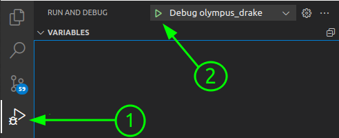
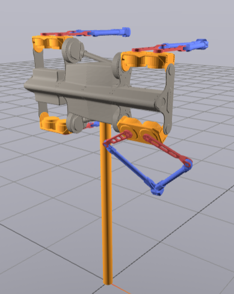

This package contains the drake simulation for olympus which is interfaced with ROS for olympus.   

**Key feautures**

1. Decoupled drake simulation from ros interface for easier development
2. ROS interface uses the API of the actual robot as of 30/6/24
3. Lab experiments can be simulated as is. See [this](#simulating-lab-experiments-or-floating-conditions)
4. Simulation documentation available [here](https://ntnu-arl.github.io/olympus_mpc_demo/).

**Dependencies**
1. `olympus_ros_msgs`. (Modified msgs from original package)


# Structure

There are two packages, `olympus_drake` and `olympus_drake_ros`. The first containts the drake simulation for the quadruped, while the second is a layer which exposes key drake features in ROS.


`olympus_drake` is independent of ros. 
This allows to easily check the a) simulation parameters, b) simulation configuration (eg. states, diagram etc) and c) test new features (eg. new low level controllers) in a step-by-step manner.

`olympus_drake_ros` is a package that exposes key quantities in ros (joint states and controller inputs). It uses the same message types as the actual robot, so a controller working on simulation can be immidiately tested on the actual hardware. 

## Recommended workflow

1. Develop and test new simulation features/componenets in `olympus_drake`. 
2. Build and **install** the `olympus_drake` library, so that it can then be found using `find_package()` by `olympus_drake_ros`. This can be done using the `olympus_drake/scripts/build_lib.sh` script. 


3. Build `olympus_drake_ros` to link to the updated library


This way, the `olympus_drake` library is not compiled every time the ros packages are compiled (eg. running `catkin build`).
However, installing the latest version must be done manually! 

### Extras
1. There is a script to update the urdf if a new edition is created
2. The `CMakeLists.txt` in the current directory allows for using the CMake Tools in VSCode  

# Setup

### 1. Install drake (pre-compiled binary version)


To download the latest stable release in ubuntu via apt, follow [these instructions](https://drake.mit.edu/apt.html#stable-releases)

To verify the installation, follow the instructions [here](https://github.com/RobotLocomotion/drake-external-examples/tree/main/drake_cmake_installed_apt) (you need also install the build-essential and cmake APT packages):

```shell
sudo apt-get update
sudo apt-get --no-install-recommends install build-essential cmake 

# download drake examples
mkdir drake_test
cd drake_test
git clone https://github.com/RobotLocomotion/drake-external-examples
cd drake-external-examples/drake_cmake_installed_apt

# build the example
mkdir build
cd build
cmake ..
make

# run the tests to verify installation
cd build
ctest .
```

Notes:

- Generally, there several pre-compiled binary versions of drake, outlined [here](https://drake.mit.edu/installation.html#choose-an-installation-method) and it can be even build from source. 
- The current version of this package uses the 1.26  release of drake, as it was developped on Ubuntu focal 20.04. The latest version of drake as of 10/9/24 is 1.32 which is supported in Ubuntu Jammy 22.04. For more info on releases check [this](https://github.com/RobotLocomotion/drake/releases).

### 2. Donwload and build the package. 

1. Download the package
In `olympus_ws`: 
```shell
#in olympus workspace
cd src
git clone git@github.com:ntnu-arl/olympus_simulation.git
```

2. Build & Install the `olympus_drake` library:
```shell
./olympus_simulation/olympus_drake/scripts/build_lib.sh
```

This script installs the library in `<olympus_ws_name>/install`, so that dependent packages can find it.

3. Build the workspace normally with `catkin build` or `catkin build olympus_drake_ros`. 

# Running the library 

## Run the drake simulation without ros. 

From the `olympus_drake` directory (To keep the relative path to the urdf & their meshes). 
```shell
$ ./build/olympus_drake_sim
```

### Vscode specific instructions
Using the [CMake Tools](https://marketplace.visualstudio.com/items?itemName=ms-vscode.cmake-tools) extensions, the simulation can be launched & debugged straight from vscode, using the  Command Pallete (`Ctrl`+`Shift`+`P`).

First the CMake Files Need to be configured. 
```command pallete
CMake: Configure
```

- The following assume the working directory is *olympus_simulation*.
#### Running the simulation

The following tasks have been created and can be launched from the command pallete. 
```
Tasks: Run Task
  └─> build olympus_drake
  └─> Launch olympus drake simulation
```

#### Debugging

Debugging has been configured, and can be launched straight from vscode. 

<div style="text-align: center;">
    
</div>

## Running the ROS simulation

```
roslaunch olympus_drake_ros sim.launch
```

The generated topics (apart from `/clock`) are:
```
/leg1_node/command_position
/leg1_node/motor_statuses
/leg2_node/command_position
/leg2_node/motor_statuses
/leg3_node/command_position
/leg3_node/motor_statuses
/leg4_node/command_position
/leg4_node/motor_statuses
/qualisys/olympus/odom
```
which are the same as the one generated by the actual robot and the mocap system. 

## Configuration options:

1. Simulation parameters. These can be changed from `olympus_drake/config`
- `olympus_param.yaml`:  plant definitions, order of joints, damping and configuration selection 
- `simulation_param.yaml`: general simulation parameters (eg. gravity, timestep etc)

2. Ros specific parameters. These can be changed from `olympus_drake_ros/config/simulation_setup.yaml`


### Simulating lab experiments or floating conditions

By changing the `base_joint_type` in `olympus_param.yaml` one can simulate the robot welded to the world, free floating (as when it jumps) or being attached to the testbed for roll (`revolute_x`), pitch (`revolute_y`) and yaw (`revolute_z`). 

<div style="text-align: center;">
    
</div>

