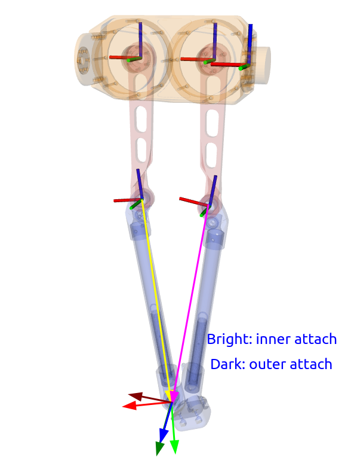

This package is responsible for setting the drake simulation of the quadruped olympus.


# Prerequisites

## 1. Creating the meshes for updated urdf
If a new urdf is created, with the appropriate collision and visual geometry in `.stl` format, the simulation model can be updated with the following process. 

1. Install the [trimesh](https://trimesh.org/) library. It requires numpy version 1.21 at 22/5/24.

`pip install trimesh[easy]`

2. Run the following script. It creates a new urdf which loads meshes without relying on ros packages and `package:\\`. Also, it creates `.obj` meshes from the existing `.stl` using the trimesh library. 

`python3 urdf_prepare.py `

## install the drake sim  library:


```shell
curr_path=$(realpath .)
cd src/olympus_sim/olympus_drake
mkdir build
cd build
cmake -DCMAKE_INSTALL_PREFIX=$curr_path/install ..
make
make install
cd $curr_path
export CMAKE_PREFIX_PATH=$curr_path/install:$CMAKE_PREFIX_PATH
echo 'export CMAKE_PREFIX_PATH='$curr_path'/install:$CMAKE_PREFIX_PATH' >> devel/setup.bash
```

## Bushing Joint

The bushing joint connects the following frames (`x-axis`: red, `y-axis`: green, `z-axis`: blue). So, traslation can happen in x-y and rotations in z. 
- To enforce the closure of the kinematic chain, force stiffness and damping must be added in x-y directions, 
while 
- to simulate friction in the joint, damping must be added in the z direction.

See `config/olympus_param.yaml`.

<div style="text-align: center;">
    
</div>

# Notes
## Add damping in the simulation

Drake does not modify the dynamic parameters of the multibody elements of a urdf, so to add joint damping, the urdf must be modified to include it.